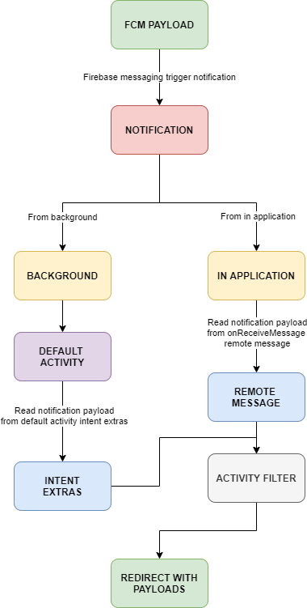

<h1 align="center">Welcome to Notiv 👋</h1>
<p>
  
  <a href="#" target="_blank">
    
  </a>
  
  
</p>


> Short introduction, this is helps you for notification redirect with FCM payload, this will be handle background notification click and on app notification click

## How it's works?



## Contribute?

Read the terms https://github.com/muhammadisa/notiv/blob/master/CONTRIBUTING.md

## Need Example?

Just click this link https://github.com/muhammadisa/notiv/tree/master/app/src/main/java/com/xoxoer/notiv

## Install

For installation just add this code in your app build.gradle file

```groovy
implementation 'com.github.muhammadisa:notiv:1.0.0'
```

## Prerequisite

1. Add Google Service
2. Add Firebase Messaging

## Simple Usage

1. Create constant for activities

   ```kotlin
   object Constant {
       val activityMapper = mapOf(
           "MAIN" to MainActivity(), // your activity class
           "SECOND" to SecondActivity() // your activity class
       )
   }
   ```
   
2. Create AppFirebaseMessaging class

   ```kotlin
   @SuppressLint("MissingFirebaseInstanceTokenRefresh")
   class AppFirebaseMessaging : NotivFirebaseService(
       channelId = "default",
       iconId = R.drawable.ic_launcher_foreground,
       defaultActivities = SplashActivity(), // this is default activity
       activities = Constant.activityMapper // this is activities using map
   )
   ```
   
3. Add this to your AndroidManifest.xml inside <application> tag

   ```kotlin
   <meta-data
       android:name="firebase_messaging_auto_init_enabled"
       android:value="false" />
   <meta-data
       android:name="com.google.firebase.messaging.default_notification_icon"
       android:resource="@drawable/ic_launcher_foreground" />
   <meta-data
       android:name="com.google.firebase.messaging.default_notification_channel_id"
       android:value="default" />
   
   <service
       android:name=".AppFirebaseMessaging"
       android:exported="false">
       <intent-filter>
   	    <action android:name="com.google.firebase.MESSAGING_EVENT" />
       </intent-filter>
   </service>
   ```

   

4. Inside default activity class

   ```kotlin
   import android.os.Bundle
   import android.util.Log
   import androidx.appcompat.app.AppCompatActivity
   import com.xoxoer.notivlibrary.NotivUtil.activityMapper
   import com.xoxoer.notivlibrary.NotivUtil.getFCM
   import com.xoxoer.notivlibrary.NotivUtil.redirectWithIntentData
   import com.xoxoer.notivlibrary.NotivUtil.resolveClickAction
   
   class SplashActivity : AppCompatActivity() {
   
       override fun onCreate(savedInstanceState: Bundle?) {
           super.onCreate(savedInstanceState)
           setContentView(R.layout.activity_splash)
   
           autoRedirect()
   
           getFCM {
               Log.e("FCM_RETRIEVED", it)
           }
       }
   
       private fun autoRedirect() {
           resolveClickAction(intent) { action ->
               val activity = activityMapper(action, Constant.activityMapper)
               startActivity(redirectWithIntentData(this, intent, activity))
           }
       }
   }
   ```

5. Inside inside activity which will receive value from notification

   ```kotlin
   import android.os.Bundle
   import android.util.Log
   import androidx.appcompat.app.AppCompatActivity
   import com.xoxoer.notivlibrary.NotivUtil.resolveRedirectResult
   
   class MainActivity : AppCompatActivity() {
   
       override fun onCreate(savedInstanceState: Bundle?) {
           super.onCreate(savedInstanceState)
           setContentView(R.layout.activity_main)
   
           resolveRedirectResult<Person>(intent) {
               // do your logic here
               Log.e("KEY_1", it.first?.key1.toString())
               Log.e("KEY_2", it.first?.key2.toString())
               Log.e("KEY_3", it.first?.key3.toString())
               Log.e("KEY_4", it.first?.key4.toString())
   
               Log.e("PARCELABLE NAME", it.second?.name.toString())
               Log.e("PARCELABLE AGE", it.second?.age.toString())
           }
       }
   }
   ```

   

   ```kotlin
   import android.os.Bundle
   import android.util.Log
   import androidx.appcompat.app.AppCompatActivity
   import com.xoxoer.notivlibrary.NotivUtil.resolveRedirectResult
   
   class SecondActivity : AppCompatActivity() {
   
       override fun onCreate(savedInstanceState: Bundle?) {
           super.onCreate(savedInstanceState)
           setContentView(R.layout.activity_second)
   
           resolveRedirectResult<Person>(intent) {
               // do your logic here
               Log.e("KEY_1", it.first?.key1.toString())
               Log.e("KEY_2", it.first?.key2.toString())
               Log.e("KEY_3", it.first?.key3.toString())
               Log.e("KEY_4", it.first?.key4.toString())
   
               Log.e("PARCELABLE NAME", it.second?.name.toString())
               Log.e("PARCELABLE AGE", it.second?.age.toString())
           }
       }
   }
   ```

## Send FCM Test

```json
Method: POST
Header: Authorization key=your_server_key
Header: Content-Type application/json
----------------------------------------

Body Request
------------
{
    "to": "device_fcm_token",
    "priority": "high",
    "notification": {
        "body": "Body of Your Notification",
        "title": "Title of Your Notification"
    },
    "data": {
        "body": "Body of Your Notification",
        "title": "Title of Your Notification",
        "click_action": "MAIN",
        "json": "{\"name\":\"Wake\",\"age\":29}",
        "key_1": "Value for key_1",
        "key_2": "Value for key_2",
        "key_3": "Value for key_3",
        "key_4": "Value for key_4"
    }
}
```


## Author

👤 **Muhammad Isa Wijaya Kusuma**

* Github: [@muhammadisa](https://github.com/muhammadisa)

## Show your support

Give a ⭐️ if this project helped you!

***
_This README was generated with ❤️ by [readme-md-generator](https://github.com/kefranabg/readme-md-generator)_

